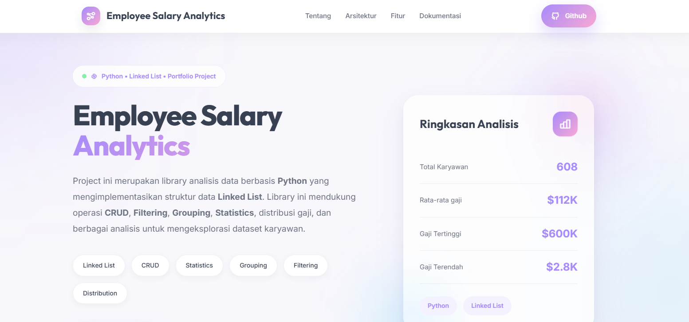
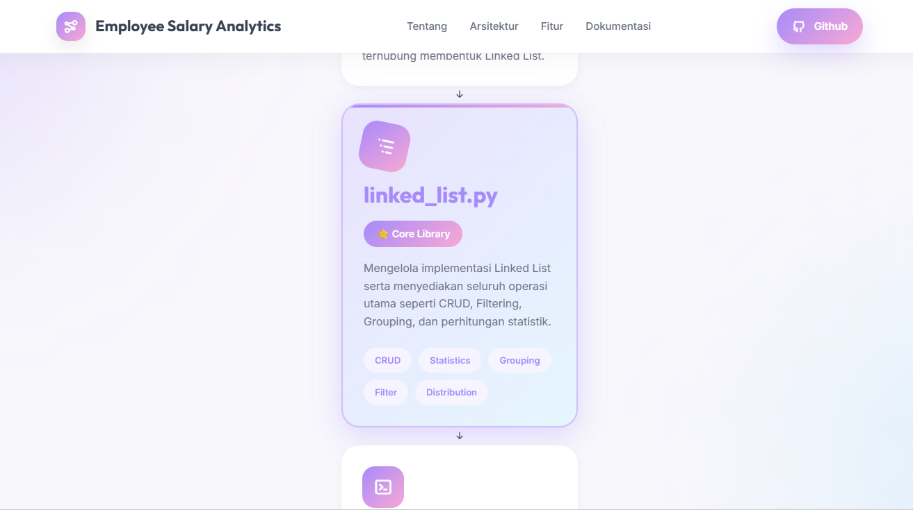
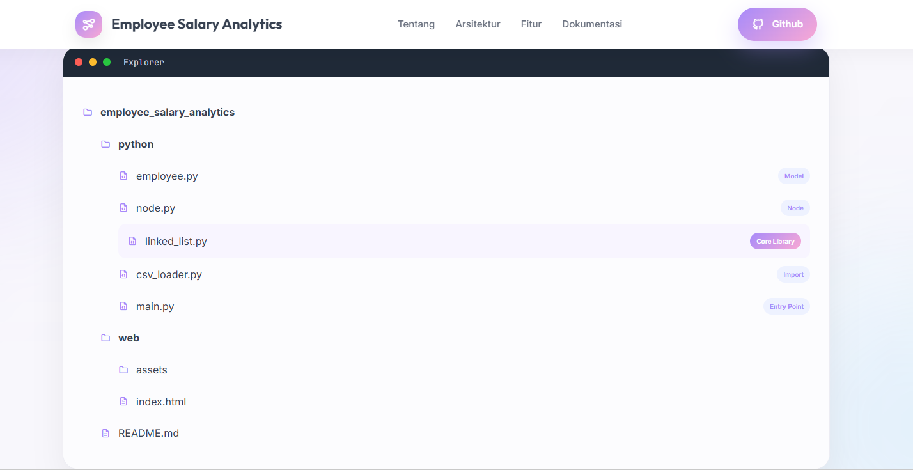
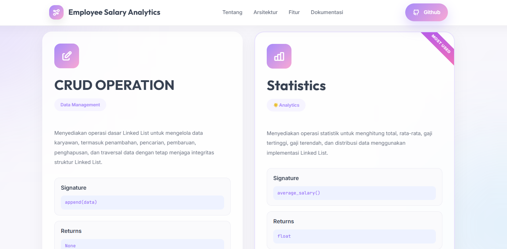
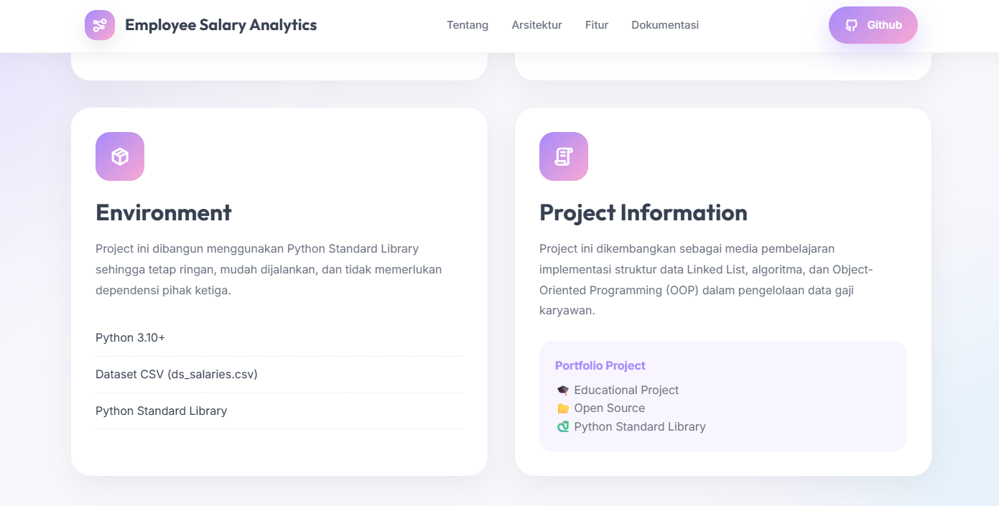

# Employee Salary Analytics System


A Python project that demonstrates how a **Linked List** data structure can be used to manage and analyze employee salary datasets without relying on built-in database systems or external libraries such as Pandas.

The project loads employee salary records from a CSV file, stores them as linked nodes, and provides various CRUD operations and statistical analyses.

---

## Live Demo

Visit the project documentation website:

👉 https://good-pastel.github.io/employee-salary-analytics/

---

## 📸 Preview



---

# 📖 Table of Contents

- [Features](#-features)
- [Project Architecture](#-project-architecture)
- [Project Structure](#-project-structure)
- [Technologies](#-technologies)
- [Implemented Operations](#implemented-operations)
- [Dataset](#dataset)
- [Screenshots](#screenshots)
- [Learning Objectives](#learning-objectives)
- [Author](#author)

---

## ✨ Features

- Import employee data from CSV
- Linked List implementation from scratch
- Insert employee records
- Delete employee records
- Update employee information
- Search employees
- Count records by category
- Calculate average salary
- Find highest salary
- Find lowest salary
- Salary distribution analysis
- Group statistics

---

## 🏗 Project Architecture



The workflow consists of:

CSV Dataset

↓

Employee Object

↓

Node

↓

Linked List

↓

Statistics & Analytics

---

## 📂 Project Structure



```text
employee-salary-analytics/
│
├── data/
│   └── ds_salaries.csv
│
├── employee.py
├── linked_list.py
├── csv_loader.py
├── node.py
├── main.py
│
└── README.md
```

---

## 💻 Technologies

- Python
- Object-Oriented Programming (OOP)
- Linked List Data Structure
- CSV Module

---

## Implemented Operations

### CRUD

- Append
- Insert Before
- Insert After
- Update
- Delete
- Delete by Index
- Search
- Search by Job Title

### Statistics

- Total Employees
- Average Salary
- Highest Salary
- Lowest Salary
- Salary Distribution
- Count by Attribute
- Total Salary by Attribute
- Average Salary by Attribute

---

## Dataset

Dataset used:

**ds_salaries.csv**

Columns used:

- work_year
- experience_level
- employment_type
- job_title
- salary_in_usd
- employee_residence
- remote_ratio
- company_location

### 📝 Design Decision

For this project, **`salary_in_usd`** is used as the primary source for all salary analysis.

The original dataset also provides the columns **`salary`** and **`salary_currency`**. However, these fields are intentionally excluded because salaries are reported in different local currencies, making direct comparisons inaccurate.

Using the normalized **`salary_in_usd`** values ensures that all statistical calculations, including average salary, highest salary, lowest salary, total salary, and salary distribution are performed on a consistent and comparable scale.

This design simplifies the implementation while producing meaningful and reliable analytical results.

---

## Screenshots

### Home


### Features



### Documentation



---

## Learning Objectives

This project was built to practice:

- Linked List implementation
- Object-Oriented Programming
- Data manipulation without Pandas
- Algorithmic thinking
- CRUD operations
- Data aggregation

---

## Author

**Devi Yolanda**

Technical Writer • Python Learner • Aspiring Data Analytics
